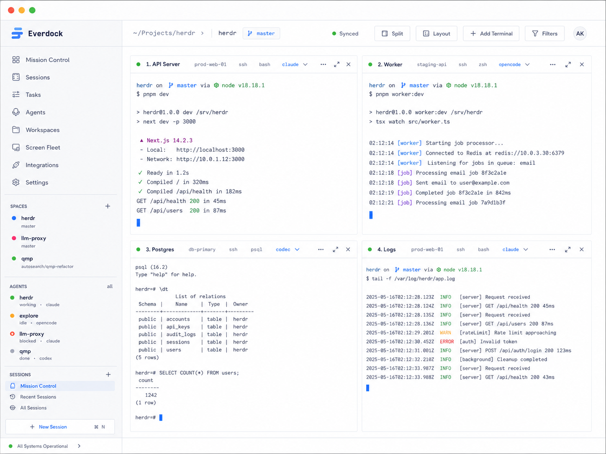
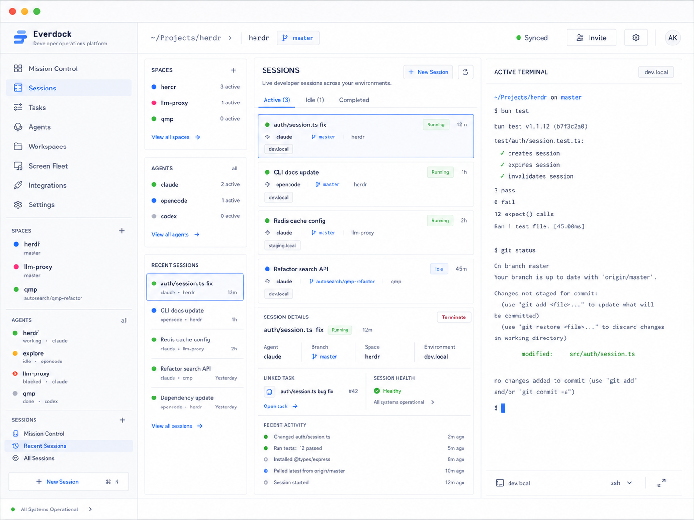
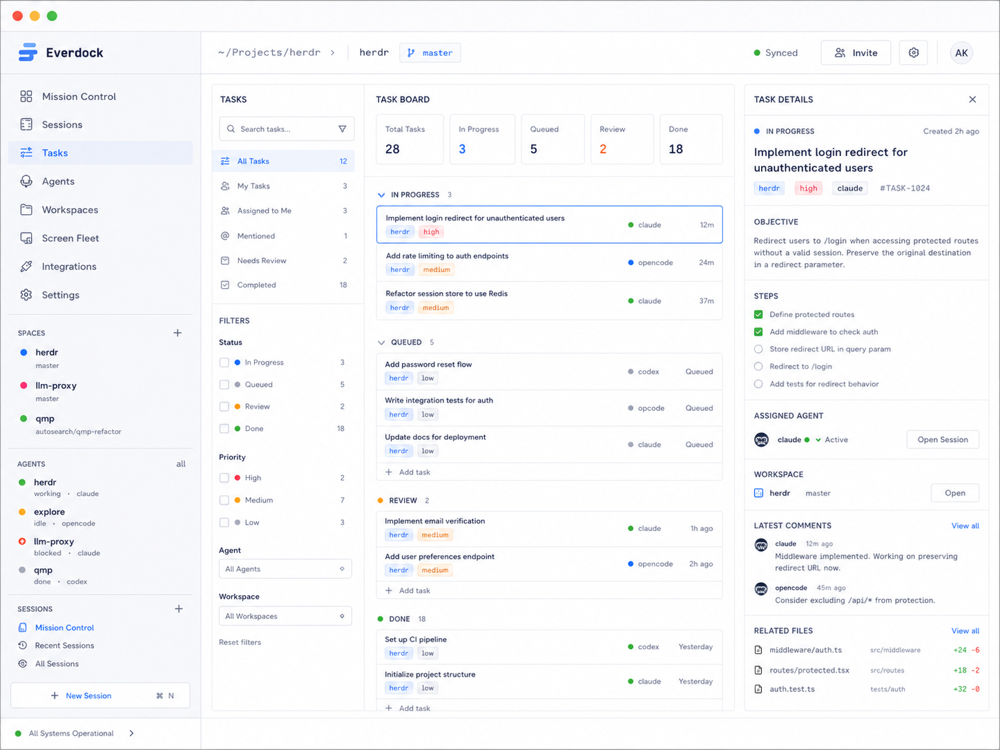
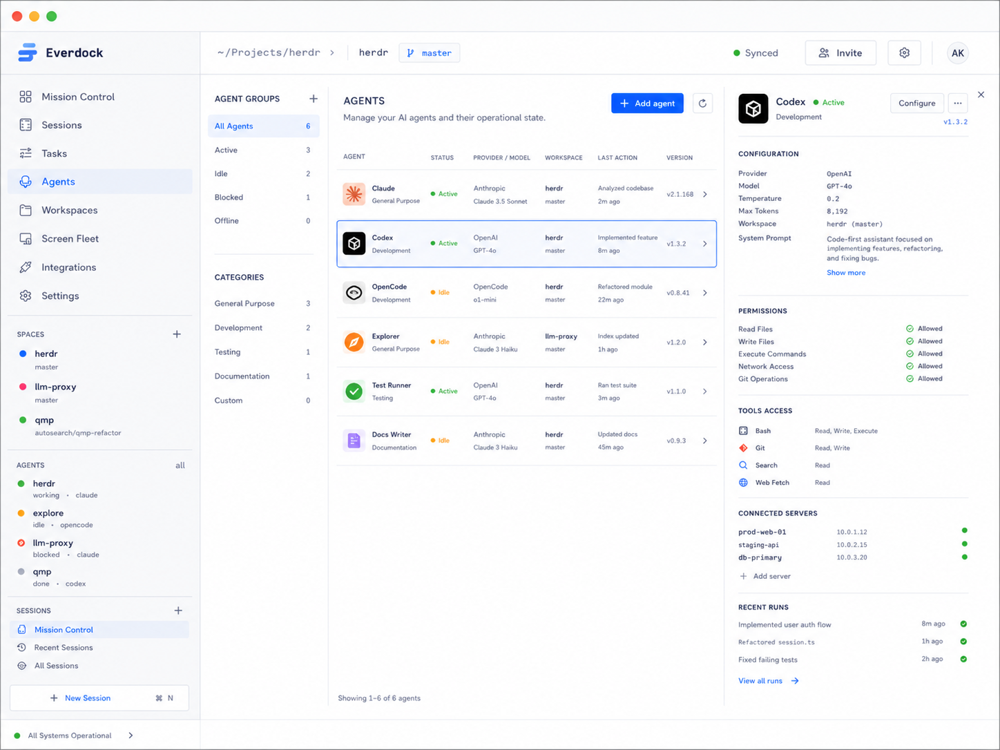
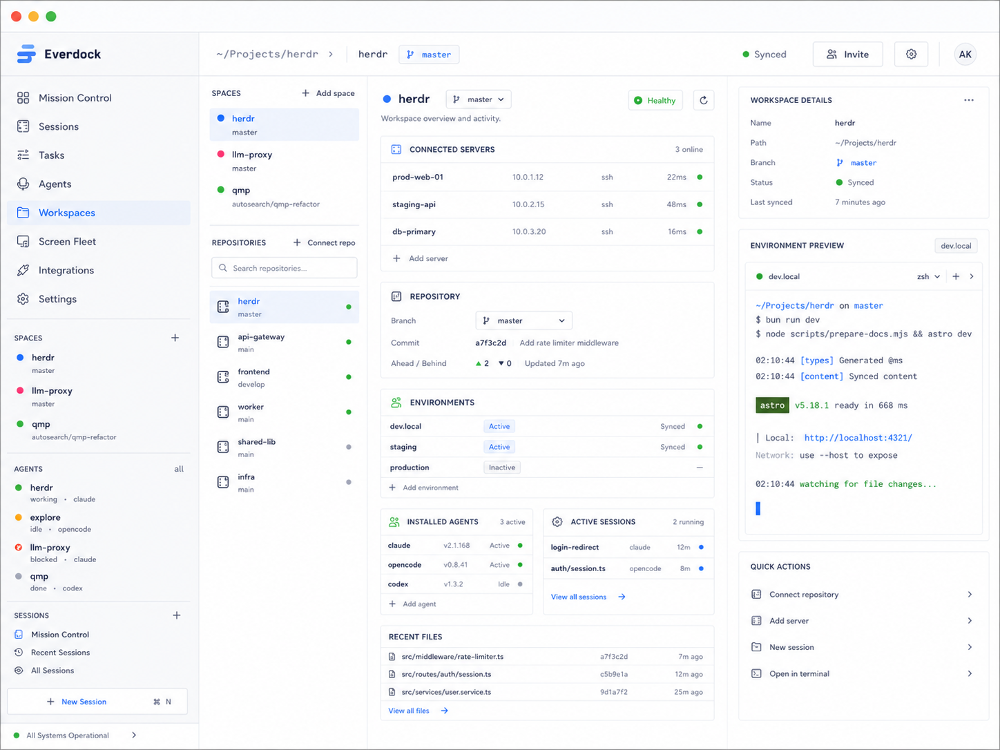
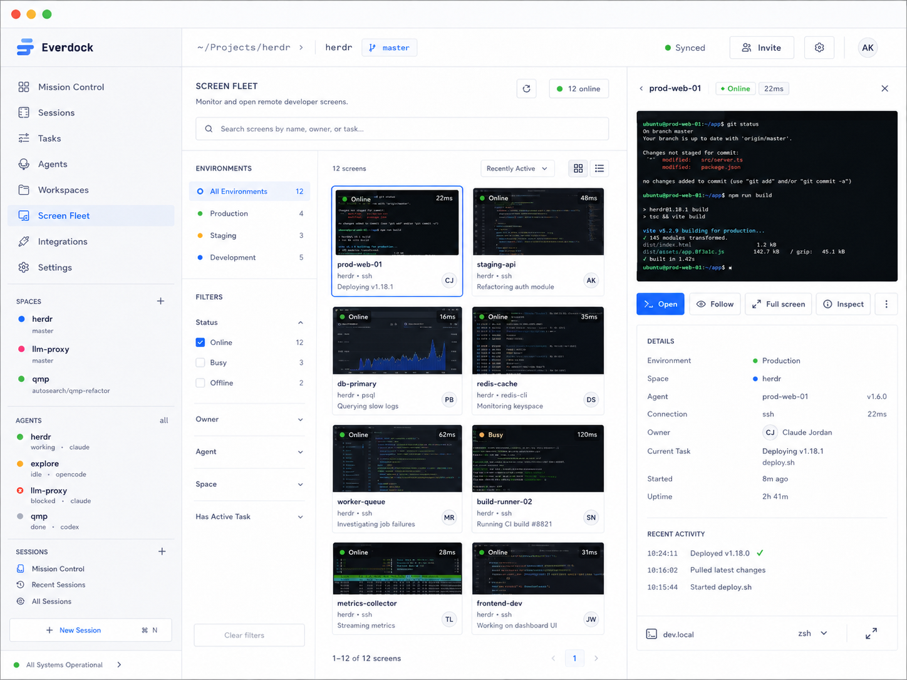
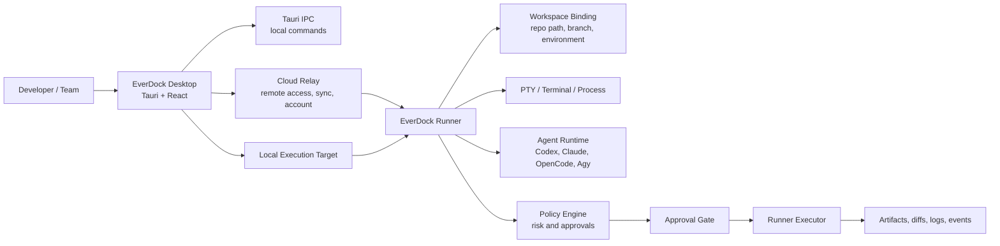

# EverDock Desktop

> **Public-source note**
>
> EverDock is under active development. This public repository contains the desktop-first prototype, UI system, local app foundation, product docs, and architecture drafts. Some managed-server, relay, billing, security, and commercial implementation details may remain private while the product is being tested and refined.



**EverDock Desktop** is a desktop-first AI developer workstation and control plane for running, monitoring, controlling, and approving AI coding agents on local machines, SSH servers, and Runner-managed servers.

EverDock is designed for developers and teams that want AI coding agents such as Codex, Claude Code, OpenCode, Agy, Gemini CLI, Antigravity, or custom agent CLIs to work continuously on real repositories without losing visibility, approvals, auditability, or human takeover.

Repository: `github.com/kyoo-147/EverDock_Desktop`

## Why EverDock Exists

AI coding agents are becoming useful enough to run long tasks, inspect codebases, write patches, run tests, and prepare pull requests. The operational problem is no longer only "how to chat with an agent." The harder problem is:

- where the agent runs
- how long the session survives
- who can see the terminal
- which server or workspace the agent can touch
- when the agent must ask for approval
- how risky commands, secrets, git pushes, and deployments are controlled
- how developers can reconnect, review, and take over

EverDock focuses on that control layer.

The core product promise is:

```text
Run AI agents on your server.
Control them from anywhere.
Keep everything observable, reviewable, and safe.
```

## Current Product Direction

EverDock is moving from UI/product prototype toward a Runner-backed AI work control plane.

The current direction includes:

- desktop-first workspace for active developer control
- durable Runner sessions for long-running background work
- terminal panes, session restore, task orchestration, agent status, and remote screen previews
- support for multiple agent runtimes rather than one vendor-specific assistant
- approval enforcement at the Runner Executor boundary, not only in the UI
- event journaling, audit trails, artifacts, diffs, and replay-ready session history
- Server Dock and WorkspaceBinding concepts for local, SSH, self-hosted, and managed execution targets
- future mobile, Telegram, Slack, and API control surfaces on top of the same execution model

EverDock is currently in active development and testing inside developer workflows to improve remote AI work, task review, agent coordination, and execution safety.

## Visual Overview

### Terminal Workspace


The Terminal Workspace is the main work surface. It combines multiple panes for API servers, workers, databases, logs, and agent-controlled shells. The goal is to let a developer watch several execution surfaces at once, send commands, inspect output, and keep context for each workspace.

### Sessions



Sessions are persistent work contexts. A session can contain terminals, agent runs, linked tasks, activity timeline, health state, and recent terminal output. In the product model, a Runner-managed session should survive desktop disconnects and later reconnect with missed events.

### Tasks



Tasks represent user intent. A task can create one or more task runs, assign work to agents, track steps, expose related files, and move through states such as queued, in progress, review, blocked, and done. EverDock treats task completion as a governed workflow, not just an agent self-report.

### Agent Fleet



Agent Fleet separates provider, runtime, profile, installation, and active session concepts. This lets the product support Codex, Claude Code, OpenCode, Gemini CLI, Agy, and custom CLIs while showing permissions, tool access, connected servers, recent runs, and status in one place.

### Workspaces



Workspaces connect repositories to execution targets. The key concept is `WorkspaceBinding`: one workspace can be bound to local machines, SSH hosts, staging servers, production runners, or managed EverDock servers with different branches, paths, policies, secrets, and health states.

### Screen Fleet



Screen Fleet provides lightweight visibility into remote terminals and development screens. It is meant for monitoring, follow/open/full-screen flows, and quick inspection of remote work, not as a replacement for the Runner approval and audit boundary.

## System Architecture

EverDock is structured around a desktop client, a local/native app layer, and a future Runner/relay execution architecture.



The important boundary is the Runner Executor. If EverDock only showed an approval prompt in the UI, an agent or custom CLI could bypass it. The product direction is to normalize risky operations into `ActionIntent`, evaluate policy, require approval when needed, and only then execute through the managed runner path.

## Core Domain Model

EverDock is not modeled as one terminal connected to one repo. The product uses explicit entities:

```text
Account
-> Space
-> Repository
-> Workspace
-> WorkspaceBinding
-> ExecutionTarget
-> Runner
-> Session
-> Pane / Terminal / Process
-> Task
-> TaskRun
-> AgentSession
-> ActionIntent
-> Approval
-> Artifact / Diff / Event / AuditEvent
```

Key design decisions:

- `Workspace` is logical project state.
- `WorkspaceBinding` binds a workspace to a concrete target/path/environment.
- `Session` is a persistent work context, not a WebSocket connection.
- `Pane` is a visual surface, not the process itself.
- `Terminal` is a PTY-backed stream.
- `Task` is user intent.
- `TaskRun` is a concrete execution attempt.
- `AgentProvider`, `AgentRuntime`, `AgentInstallation`, `AgentProfile`, `AgentInstance`, and `AgentSession` are separate concepts.
- `ActionIntent` and `Approval` exist before risky execution, not after.

## Runner Protocol Direction

Durable background work depends on the Runner.

The Runner is responsible for:

- remote PTY and process lifecycle
- agent runtime detection and launch
- session persistence
- event journal and reconnect sequence
- approval enforcement
- artifact and diff collection
- workspace binding health
- heartbeat and diagnostics
- recovery after app close, network drop, or runner restart

MVP transport is expected to combine request/response commands, event streaming, heartbeat, and reconnect with sequence resume.

```text
Runner <-> Desktop direct connection when available
Runner <-> Cloud Relay <-> Desktop when remote, off-LAN, mobile, or multi-device
```

SSH-only mode can help bootstrap or inspect lightweight sessions, but it should be labeled as non-durable unless execution is routed through the Runner.

## Security And Approval Model

EverDock assumes AI agents can run dangerous commands. The product is therefore designed around least privilege, policy enforcement, auditability, and human approval.

Risk levels:

| Level | Example actions | Default behavior |
| --- | --- | --- |
| Low | read files, list directories, run safe tests | can be auto-approved |
| Medium | edit files, install packages, create branch | policy-dependent |
| High | push branch, create PR, access secrets, deploy preview | explicit approval |
| Critical | production deploy, destructive command, sudo/root, production secret | always requires approval |

Approval pipeline:

```text
User or agent intent
-> ActionIntent
-> Action Normalizer
-> Policy Engine
-> Risk Classifier
-> Approval Gate
-> Runner Executor
-> Audit/Event write
-> Result/Artifact
```

Security controls under design:

- command allowlists and blocklists
- secret masking and scoped leases
- workspace filesystem boundaries
- event and audit logs
- human takeover lock
- branch/worktree isolation for task runs
- production binding policy overrides
- budget and cost runaway controls
- runner revoke and credential rotation

## Current Implementation Status

Implemented in the public repository:

- Tauri v2 desktop shell foundation
- React + TypeScript + Tailwind CSS v4 interface
- desktop-first navigation and workspace shell
- Terminal Workspace screen with multi-pane terminal layout
- Sessions screen with session list, detail panel, timeline, and active terminal
- Tasks screen with task board, details, steps, assigned agent, comments, and related files
- Agent Fleet screen with runtime/profile table and permission detail panel
- Workspaces screen with connected servers, repository state, environments, installed agents, sessions, files, and environment preview
- Screen Fleet screen with remote screen cards and inspection panel
- Mission Control, Integrations, and Settings surfaces
- TypeScript domain types for agents, approvals, sessions, tasks, terminals, and workspaces
- mock data layer for UI/product simulation
- Rust/Tauri module structure for storage, domain, remote, security, workflow, sessions, PTY, processes, and agent runtime adapters
- SQLite migration draft and local storage module foundation
- product documentation for PRD, SRS, feature catalog, data model, Runner protocol, IPC contract, security, and roadmap

Still under development:

- production Runner daemon
- real remote PTY streaming and durable session recovery
- full approval enforcement through Runner Executor
- cloud relay, account, device sync, and mobile/Telegram control
- real agent adapter integration for Codex, Claude Code, OpenCode, Agy, Gemini CLI, and custom CLIs
- production secret vault and policy engine
- artifact/diff persistence and replay
- managed server provisioning and billing
- team permissions and enterprise audit export

## Repository Layout

```text
src/                         React desktop frontend
src/pages/                   Mission Control, Terminal, Sessions, Tasks, Agents, Workspaces
src/features/                Feature-level UI modules
src/components/              Shared shell and UI components
src/types/                   Frontend domain contracts
src/mocks/                   UI simulation data
src/lib/ipc.ts               Tauri IPC helper boundary
src-tauri/                   Tauri/Rust native app layer
src-tauri/src/core/          Session, PTY, and process manager foundation
src-tauri/src/security/      Approval engine foundation
src-tauri/src/remote/        SSH, tunnel, and runner modules
src-tauri/src/storage/       SQLite storage module
src-tauri/migrations/        Local database schema draft
everdock_product_docs/       Product, architecture, protocol, and roadmap documents
design/                      UI design screenshots
docs/images/                 README images
```

## Build And Run

### Prerequisites

- Node.js
- npm
- Rust and Tauri prerequisites for desktop builds

### Install dependencies

```bash
npm install
```

### Run the web UI

```bash
npm run dev
```

Vite will start the local web preview.

### Run the Tauri desktop app

```bash
npm run tauri dev
```

### Build the frontend

```bash
npm run build
```

The build runs TypeScript checking and Vite compilation.

## Product And Technical Risks

The project deliberately tracks these risks early:

- approval enforcement must live in Runner Executor, not only in the UI
- unmanaged SSH terminals cannot provide the same guarantees as Runner-managed sessions
- session durability is hard across app close, SSH drop, runner restart, and process crash
- multi-device attach requires event ordering, reconnect, and conflict handling
- agent and user concurrent edits need branch/worktree isolation
- secrets must use scoped leases, revocation, masking, and audit events
- token, compute, and server cost runaway need budgets and kill controls
- UX can become too dense if panes, tasks, approvals, diffs, and alerts are not prioritized
- agent CLI behavior can change, so adapters need versioning and capability checks

## Roadmap

Near-term engineering path:

1. Align TypeScript domain types with the product ontology.
2. Stabilize Tauri IPC payloads for sessions, terminals, tasks, agents, approvals, and workspaces.
3. Implement Runner protocol messages and event envelope.
4. Add Runner-managed terminal/session lifecycle.
5. Enforce approval decisions before risky execution.
6. Persist event journal, session metadata, terminal state, and artifacts.
7. Add real agent runtime detection and launch for one or two CLI agents.
8. Add diff/artifact review flow and completion policy.
9. Add Server Dock and Runner diagnostics.
10. Prepare private pilot flow for developer workflow testing.

Key planning docs:

- `everdock_product_docs/00_README_BRIEF.md`
- `everdock_product_docs/09_SECURITY_APPROVALS.md`
- `everdock_product_docs/16_PRODUCT_ONTOLOGY_AND_LIFECYCLE.md`
- `everdock_product_docs/17_API_IPC_RUNNER_STORAGE_SCOPE.md`
- `everdock_product_docs/18_RUNNER_PROTOCOL.md`
- `everdock_product_docs/19_TAURI_IPC_CONTRACT.md`
- `everdock_product_docs/20_SQLITE_SCHEMA_V1.md`

## License

No license has been selected yet.
